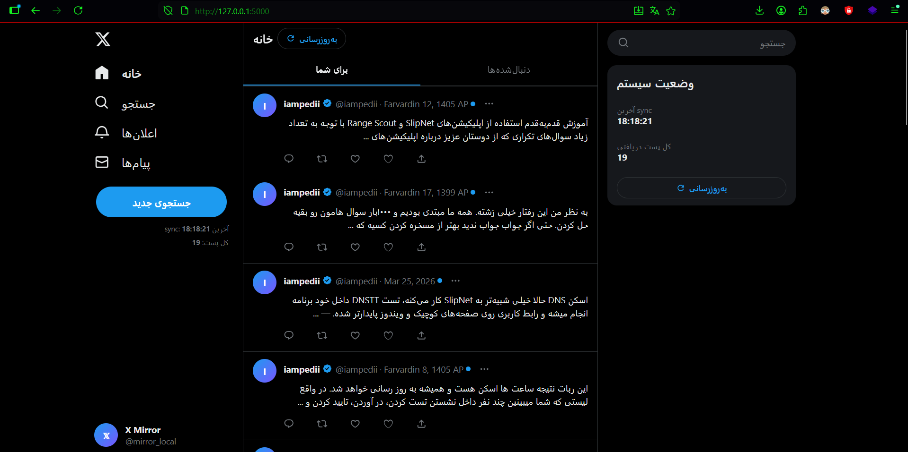
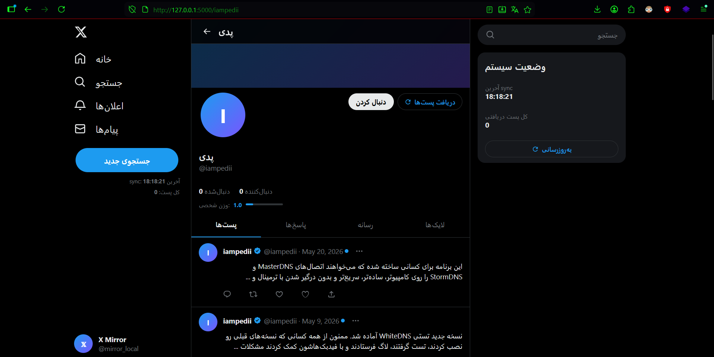
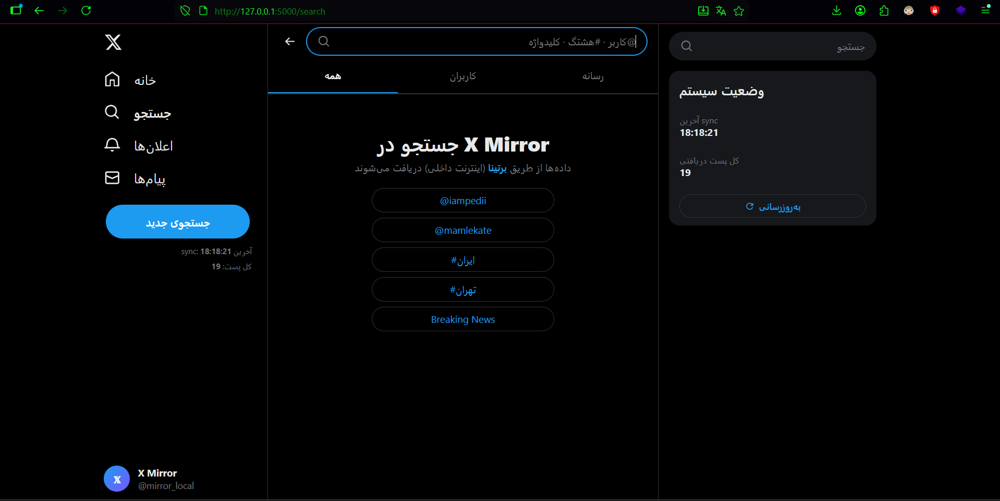

# X-Mirror

**X-Mirror** یک پروژهٔ متن‌باز و رایگان است که با تکیه بر زیرساخت‌های جست‌وجوی داخلی، امکان مشاهدهٔ محتوای X.com را به‌صورت آینه‌ای و بدون نیاز به ورود به حساب کاربری فراهم می‌کند.

> هدف این پروژه، ارائهٔ یک رابط سبک و قابل‌دسترس برای مرور محتوا در شرایط محدودیت یا قطع دسترسی است.


پروژه 100 درصد رایگان و متن باز بوده. لطفا برای حمایت از من به پروژه ستاره (Star) بدید

## 📸 تصاویر محیط







---

## معرفی سریع

X-Mirror یک ابزار مبتنی بر Python است که داده‌های موردنیاز را از طریق موتورهای جست‌وجوی داخلی دریافت می‌کند و آن‌ها را در یک رابط شبیه‌ساز X.com نمایش می‌دهد.

## قابلیت‌ها

* کاملاً متن‌باز و رایگان
* بدون نیاز به لاگین
* اجرای محلی با `127.0.0.1:5000`
* دسترسی در شبکهٔ محلی با `local-ip:5000`
* جست‌وجوی محتوا و پروفایل‌ها
* امکان ساخت نسخهٔ آفلاین HTML
* رابط سبک و ساده
* مناسب برای استفاده در شرایط محدودیت دسترسی

## نحوهٔ کار

این پروژه با استفاده از موتورهای جست‌وجوی داخلی، محتوای موردنیاز را به‌صورت ناشناس دریافت می‌کند و سپس آن را در قالبی شبیه به X.com نمایش می‌دهد.

## مزایا

* رایگان و نامحدود
* بدون نیاز به حساب کاربری
* سبک و قابل اجرا روی سیستم‌های معمولی
* قابلیت جست‌وجو
* قابلیت نمایش پروفایل‌ها
* امکان تولید خروجی HTML آفلاین

## محدودیت‌ها

* ممکن است جدیدترین پست‌ها با کمی تأخیر دریافت شوند
* نمایش تصویر، کامنت و لایک‌ها در این نسخه پشتیبانی نمی‌شود
* برخی داده‌ها به‌دلیل محدودیت‌های موتور جست‌وجو ممکن است کامل نباشند

## نصب و اجرا

### با سورس

```bash
# clone repository
git clone https://github.com/mr-r0ot/X-Mirror
cd X-Mirror

# install dependencies
pip install -r requirements.txt

# run project
python app.py
```

### نسخهٔ ویندوز

اگر از ویندوز استفاده می‌کنید، می‌توانید فایل اجرایی را از بخش Releases دانلود کنید:

**[Download Windows EXE](https://github.com/mr-r0ot/X-Mirror/releases/tag/v1.0.0)**

## استفاده

پس از اجرا، پروژه در مرورگر در آدرس زیر در دسترس خواهد بود:

```text
http://127.0.0.1:5000
```

در شبکهٔ محلی نیز می‌توانید از IP سیستم میزبان به همراه پورت `5000` استفاده کنید.

---

# English Version

## X-Mirror

**X-Mirror** is a free and open-source project that provides a mirrored way to access content from X.com by relying on local search infrastructure.

> The goal of this project is to offer a lightweight and accessible interface for browsing content in restricted or disconnected environments.

## Screenshots


## Overview

X-Mirror is a Python-based tool that fetches the required data through local search engines and displays it in an X.com-like interface.

## Features

* Free and open source
* No login required
* Runs locally at `127.0.0.1:5000`
* Accessible on the local network via `local-ip:5000`
* Content and profile search
* Offline HTML export
* Lightweight and simple interface
* Designed for restricted-access situations

## How It Works

The project retrieves the required content anonymously through local search engines and presents it in a structure similar to X.com.

## Pros

* Free and unlimited
* No account required
* Lightweight and easy to run
* Search support
* Profile viewing support
* Offline HTML output

## Limitations

* The newest posts may appear with some delay
* Images, comments, and likes are not supported in this version
* Some data may be incomplete due to search-engine limitations

## Installation and Run

### From Source

```bash
# clone repository
git clone https://github.com/mr-r0ot/X-Mirror
cd X-Mirror

# install dependencies
pip install -r requirements.txt

# run project
python app.py
```

### Windows Build

If you are using Windows, you can download the executable from Releases:

**[Download Windows EXE](https://github.com/mr-r0ot/X-Mirror/releases/tag/v1.0.0)**

## Usage

After launching, the app will be available in your browser at:

```text
http://127.0.0.1:5000
```

On a local network, you can also access it using the host machine IP with port `5000`.
